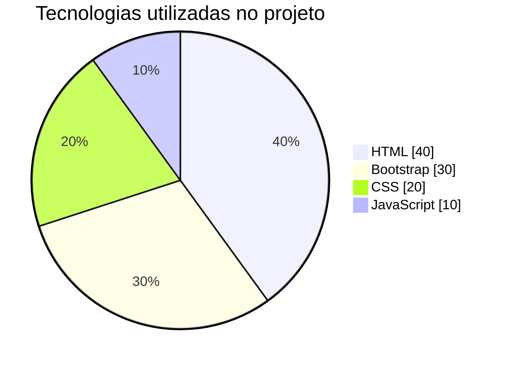
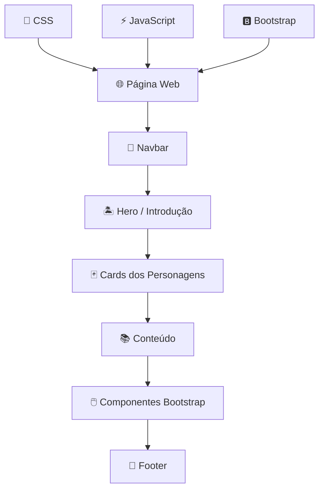

# 🌺 Lilo & Stitch | Bootstrap Showcase

<div align="center">


### 🌴 Uma interface inspirada em *Lilo & Stitch* desenvolvida para explorar o poder do Bootstrap.

> **"Ohana quer dizer família. Família quer dizer nunca abandonar ou esquecer."**

</div>

---

## 📖 Sobre o Projeto

O **Lilo & Stitch | Bootstrap Showcase** é um projeto front-end desenvolvido com o objetivo de estudar e demonstrar os principais recursos do framework **Bootstrap 5**.

A aplicação utiliza a temática de **Lilo & Stitch** para transformar o aprendizado em uma experiência mais divertida e visual.

Ao invés de construir todos os componentes manualmente com CSS, o projeto utiliza recursos prontos do Bootstrap, permitindo desenvolver interfaces modernas, organizadas e responsivas com menos código.

### 🎯 Objetivos

* Aprender os fundamentos do **Bootstrap 5**.
* Utilizar o **Grid System** para construção de layouts.
* Trabalhar com componentes reutilizáveis.
* Desenvolver páginas responsivas.
* Explorar classes utilitárias.
* Integrar Bootstrap com HTML, CSS e JavaScript.
* Praticar organização e estruturação de projetos front-end.

---

# 🖥️ Demonstração

<div align="center">


</div>

---

## ✨ Funcionalidades

| Funcionalidade             | Descrição                                                                |
| -------------------------- | ------------------------------------------------------------------------ |
| 🧭 **Navbar**              | Menu de navegação para acesso às diferentes seções da página.            |
| 🃏 **Cards**               | Cards temáticos utilizados para apresentar personagens e informações.    |
| 📱 **Responsividade**      | Layout adaptável para celulares, tablets e computadores.                 |
| 🎨 **Bootstrap Utilities** | Utilização de classes para espaçamento, cores, alinhamento e tipografia. |
| 🖱️ **Botões**             | Componentes interativos estilizados pelo Bootstrap.                      |
| 🦶 **Footer**              | Rodapé responsivo com informações e links úteis.                         |
| 📐 **Grid System**         | Organização do conteúdo através de containers, rows e columns.           |
| 📲 **Mobile First**        | Interface desenvolvida pensando primeiro em dispositivos menores.        |

---

# 🛠️ Tecnologias Utilizadas

|      Tecnologia     | Utilização                                                          |
| :-----------------: | ------------------------------------------------------------------- |
|     🌐 **HTML5**    | Estruturação semântica da página.                                   |
|     🎨 **CSS3**     | Estilos personalizados e complementares ao Bootstrap.               |
|   ⚡ **JavaScript**  | Interatividade e funcionalidades da aplicação.                      |
| 🅱️ **Bootstrap 5** | Componentes, sistema de grid, responsividade e classes utilitárias. |

---

# 📊 Visão Geral das Tecnologias

> O gráfico abaixo é apenas uma representação visual da participação das tecnologias no projeto. Os valores podem ser ajustados de acordo com o código real.



---

# 🧩 Arquitetura da Página



---

# 📱 Responsividade

O projeto utiliza o conceito **Mobile First** do Bootstrap.

Isso significa que a interface é construída inicialmente pensando em telas menores e, posteriormente, expandida para dispositivos maiores através dos *breakpoints* do framework.

| Breakpoint | Dispositivo aproximado |
| ---------- | ---------------------- |
| `xs`       | 📱 Smartphones         |
| `sm`       | 📱 Smartphones grandes |
| `md`       | 📟 Tablets             |
| `lg`       | 💻 Notebooks           |
| `xl`       | 🖥️ Desktops           |
| `xxl`      | 🖥️ Monitores grandes  |

Exemplo:

```html
<div class="row">
    <div class="col-12 col-md-6 col-lg-4">
        Conteúdo
    </div>
</div>
```

Neste exemplo:

* `col-12` → ocupa toda a tela em dispositivos pequenos.
* `col-md-6` → ocupa metade da tela em tablets.
* `col-lg-4` → ocupa um terço da tela em telas maiores.

---

# 🅱️ Como utilizar o Bootstrap

Para utilizar o Bootstrap através de **CDN**, adicione o CSS dentro da tag `<head>`:

```html
<link
    href="https://cdn.jsdelivr.net/npm/bootstrap@5.3.8/dist/css/bootstrap.min.css"
    rel="stylesheet"
>
```

Depois, antes de fechar a tag `</body>`, adicione o JavaScript:

```html
<script src="https://cdn.jsdelivr.net/npm/bootstrap@5.3.8/dist/js/bootstrap.bundle.min.js"></script>
```

O arquivo `bootstrap.bundle.min.js` já inclui o **Popper**, necessário para componentes como:

* Dropdowns
* Tooltips
* Popovers
* Menus interativos

---

# 💡 Exemplo básico

```html
<!DOCTYPE html>
<html lang="pt-BR">

<head>
    <meta charset="UTF-8">

    <meta
        name="viewport"
        content="width=device-width, initial-scale=1.0"
    >

    <title>Lilo & Stitch</title>

    <link
        href="https://cdn.jsdelivr.net/npm/bootstrap@5.3.8/dist/css/bootstrap.min.css"
        rel="stylesheet"
    >
</head>

<body>

    <div class="container py-5">

        <h1 class="text-center mb-4">
            🌺 Lilo & Stitch
        </h1>

        <div class="text-center">

            <button class="btn btn-primary">
                Ohana 💙
            </button>

        </div>

    </div>

    <script
        src="https://cdn.jsdelivr.net/npm/bootstrap@5.3.8/dist/js/bootstrap.bundle.min.js">
    </script>

</body>

</html>
```

---

# 📂 Estrutura do Projeto

Uma possível organização para o projeto:

```text
Lilo-Stitch/
│
├── 📁 assets/
│   ├── 📁 images/
│   └── 📁 icons/
│
├── 📁 css/
│   └── style.css
│
├── 📁 js/
│   └── script.js
│
├── index.html
│
└── README.md
```

---

# 🚀 Como executar o projeto

### 1. Clone o repositório

```bash
git clone https://github.com/SEU-USUARIO/Lilo-Stitch.git
```

### 2. Entre na pasta

```bash
cd Lilo-Stitch
```

### 3. Abra o projeto

Você pode simplesmente abrir:

```text
index.html
```

no navegador.

Outra opção é utilizar a extensão **Live Server** no Visual Studio Code.

---

# 🧠 Conceitos explorados

Durante o desenvolvimento deste projeto foram utilizados conceitos importantes de desenvolvimento front-end:

```text
Bootstrap
│
├── 📦 Containers
├── 📐 Grid System
│   ├── Rows
│   └── Columns
│
├── 🧩 Components
│   ├── Navbar
│   ├── Cards
│   └── Buttons
│
├── 🎨 Utilities
│   ├── Margin
│   ├── Padding
│   ├── Colors
│   └── Typography
│
└── 📱 Responsive Design
```

---

# 📈 Status do Projeto

```text
████████████████████░  95%
```

**Status:** 🟢 Projeto funcional

O projeto pode continuar recebendo melhorias, novos componentes e novas funcionalidades à medida que novos conceitos do Bootstrap forem estudados.

---

# 🔮 Possíveis melhorias futuras

* [ ] 🌙 Adicionar modo escuro.
* [ ] 🎬 Implementar animações.
* [ ] 🖼️ Criar uma galeria de personagens.
* [ ] 🔍 Adicionar sistema de busca.
* [ ] 🎠 Implementar Bootstrap Carousel.
* [ ] 🪟 Utilizar Bootstrap Modal.
* [ ] 💬 Adicionar Tooltips e Popovers.
* [ ] 📱 Melhorar ainda mais a experiência mobile.
* [ ] ⚡ Adicionar novas interações utilizando JavaScript.
* [ ] 🌐 Publicar o projeto utilizando GitHub Pages.

---

# 📚 O que aprendi

Com este projeto foi possível entender melhor como frameworks CSS podem acelerar o processo de desenvolvimento.

O Bootstrap permite criar componentes reutilizáveis e interfaces responsivas utilizando classes prontas, diminuindo a necessidade de escrever grandes quantidades de CSS.

Alguns dos principais conhecimentos praticados foram:

* Sistema de grid.
* Responsividade.
* Breakpoints.
* Containers.
* Componentes.
* Classes utilitárias.
* Organização de layouts.
* Integração entre HTML, CSS, JavaScript e Bootstrap.

---

# 🤝 Contribuições

Contribuições são sempre bem-vindas.

Caso queira melhorar o projeto:

```bash
# Faça um fork do projeto

# Crie uma branch
git checkout -b feature/minha-feature

# Faça o commit
git commit -m "feat: adiciona nova funcionalidade"

# Envie para o GitHub
git push origin feature/minha-feature
```

Depois, abra um **Pull Request**. 🚀

---

# 👨‍💻 Autor

Desenvolvido com 💙, 🌺 e muito código.

**Arthur Cavalcante**

Se este projeto foi útil para você, considere deixar uma ⭐ no repositório.

---

<div align="center">

### 🌺 Ohana significa família.

**E programar também fica melhor quando aprendemos juntos. 💙**

🅱️ Bootstrap • 🌐 HTML • 🎨 CSS • ⚡ JavaScript

</div>

